  

<h1 align="center">Shadow</h1>

  Building practical software, experimenting with ideas, and learning by shipping real projects.

  

---

### What I'm building

- **Vera** — an all-in-one Discord bot with moderation, protection, utilities, automation, and a web dashboard.
- Improving safety systems, dashboard UX, and translation features.
- Exploring useful open-source projects and learning by working on real codebases.

  

### Toolbox

  

### GitHub

  

### Public work

  

---

  Keep building. Keep learning.

