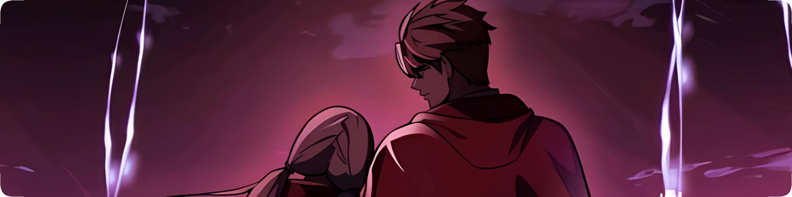

  

<h1 align="center">Shadow</h1>

  Building useful software, experimenting with ideas, and learning by shipping real projects.

  <a href="https://verabot.xyz"><b>Vera ↗</b></a>
  &nbsp;&nbsp;·&nbsp;&nbsp;
  <a href="https://github.com/ShadowUR0?tab=repositories"><b>Repositories ↗</b></a>

 

## About

I like turning useful ideas into working software instead of leaving them as concepts. Most of my time goes into building, testing, fixing, and improving real projects while learning along the way.

### Current focus

`Vera` &nbsp; `Security` &nbsp; `Anti-Phishing` &nbsp; `Automation` &nbsp; `Dashboard UX` &nbsp; `Translation`

 

## Featured project

### Vera

An all-in-one Discord bot focused on moderation, protection, utilities, automation, and a web dashboard.

`Discord` &nbsp; `Moderation` &nbsp; `Security` &nbsp; `Automation` &nbsp; `Dashboard`

**[Open Vera →](https://verabot.xyz)**

 

## Toolbox

  

 

## GitHub activity

  <picture>
    <source media="(prefers-color-scheme: dark)" srcset="./assets/stats-dark.svg" />
    <source media="(prefers-color-scheme: light)" srcset="./assets/stats-light.svg" />
    
  </picture>

 

  
<b>Other public work</b>

   
  

    <a href="https://github.com/ShadowUR0/shadow-ai-sw4-candidate-solution">
      <picture>
        <source media="(prefers-color-scheme: dark)" srcset="./assets/public-work-dark.svg" />
        <source media="(prefers-color-scheme: light)" srcset="./assets/public-work-light.svg" />
        
      </picture>
    </a>
  

 

---

  Keep building. Keep learning.

